# ZaminOS

**ZaminOS** — Zamin Phone uchun zamonaviy, konvergent operatsion tizim.

Bitta tizim — ikki ko'rinish:

- **Mobile rejim** — telefonni qo'lingizda ushlaganingizda. Sezgir, sodda,
  bir qo'l bilan boshqariladigan interfeys.
- **Desktop rejim** — Zamin Phone'ga tashqi ekran, klaviatura yoki sichqoncha
  ulanganda avtomatik ravishda yoqiladi. Yuqori panel, oynalar, vazifalar
  paneli — to'liq ish stoli tajribasi, bitta qurilmadan.

> *Zamin* (o'zbek tilida: "yer, asos") — har kuni qiladigan ishlaringiz
> tagidagi mustahkam asos.

## Xususiyatlar

- **Konvergensiya** — bir qurilma, ikki ish rejimi.
- **Mahalliy o'zbek tili** — interfeys, klaviatura va ovozli yordamchi.
- **Yangi dizayn** — toza tipografika, haqiqiy vektor ikonkalar (Phosphor
  to'plami, 130+ belgi), Inter shrift, yumshoq gradientlar.
- **Maxfiylik** — ma'lumotlaringiz qurilmangizda qoladi.

## Mobile ekranlar

| Lockscreen | Bosh ekran | Bildirishnomalar |
|:---:|:---:|:---:|
| 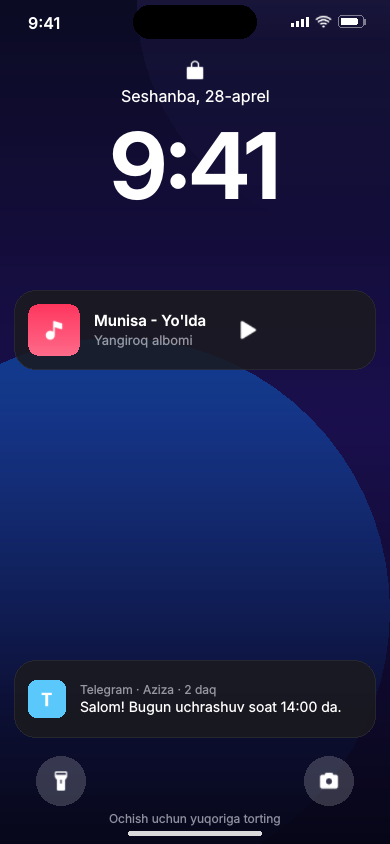 | 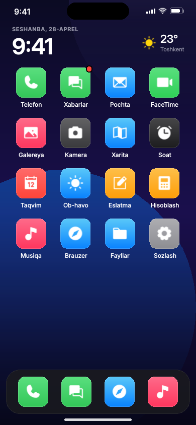 | 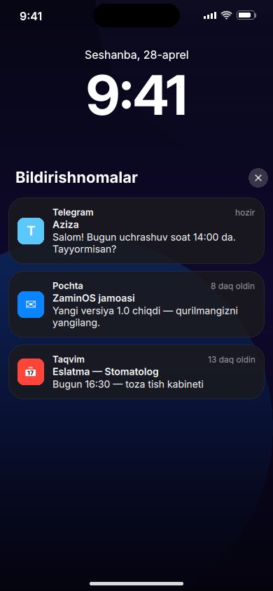 |

| Boshqaruv markazi | Ilovalar almashtirgich | Telefon (qo'ng'iroq) |
|:---:|:---:|:---:|
|  | 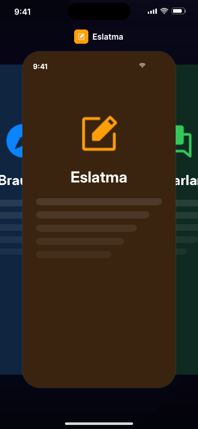 | 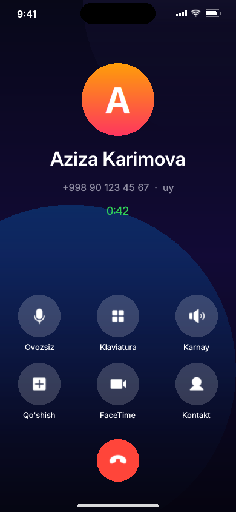 |

| Sozlamalar | Sozlamalar — Wi-Fi | Klaviatura (Xabarlar) |
|:---:|:---:|:---:|
| 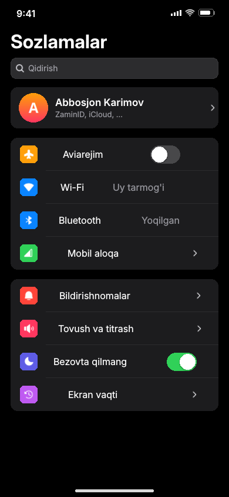 | 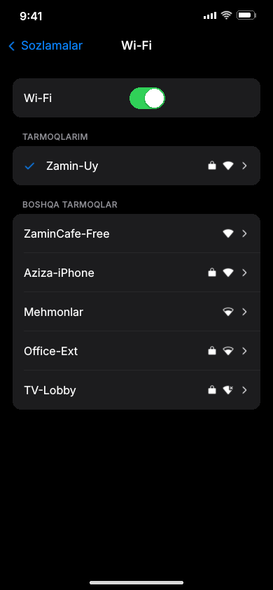 | 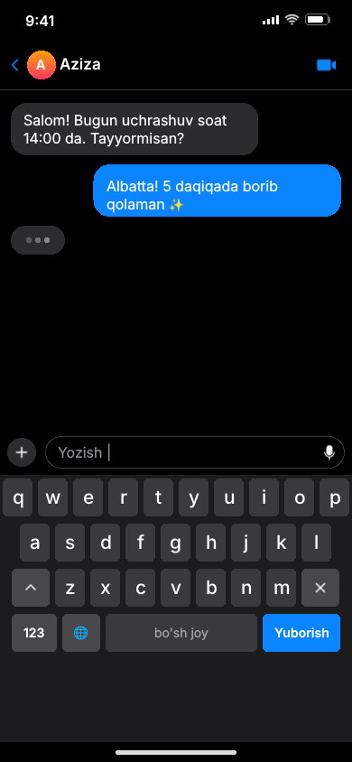 |

| Hisoblash | Eslatmalar |
|:---:|:---:|
| 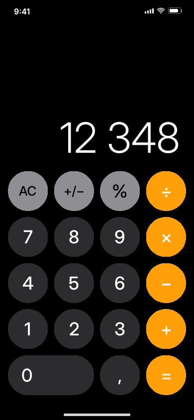 | 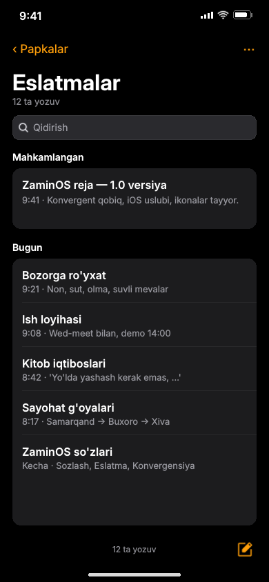 |

## Desktop ekranlar

### Kirish va bosh stol

| Kirish | Bosh stol (Sozlamalar + Eslatma) |
|:---:|:---:|
| 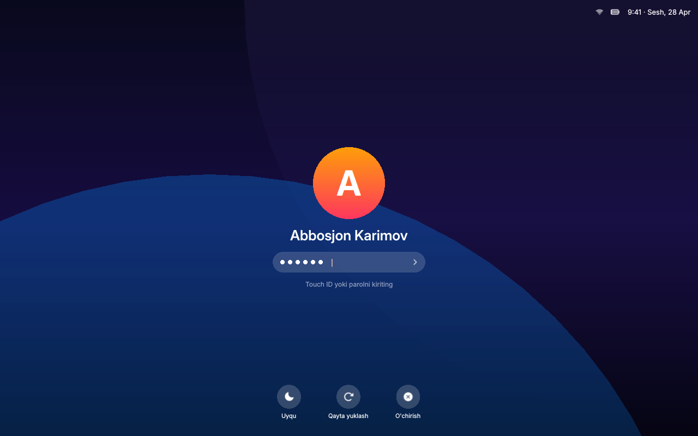 |  |

### Ilovalar

| Fayllar | Pochta |
|:---:|:---:|
| 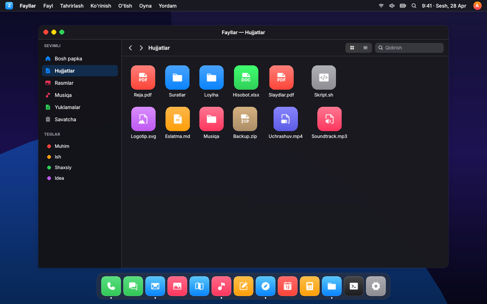 | 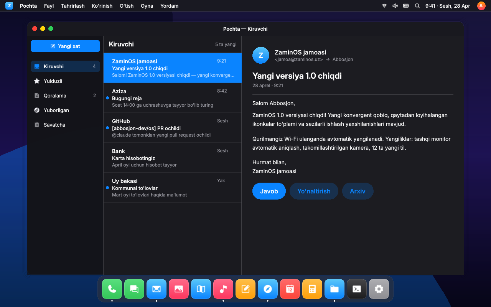 |

| Brauzer | Taqvim |
|:---:|:---:|
| 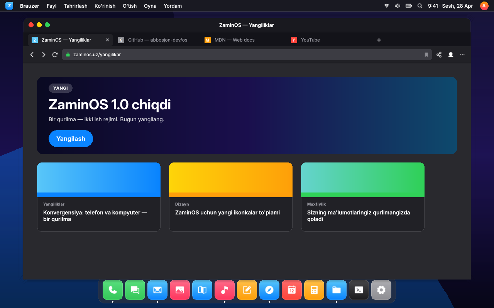 | 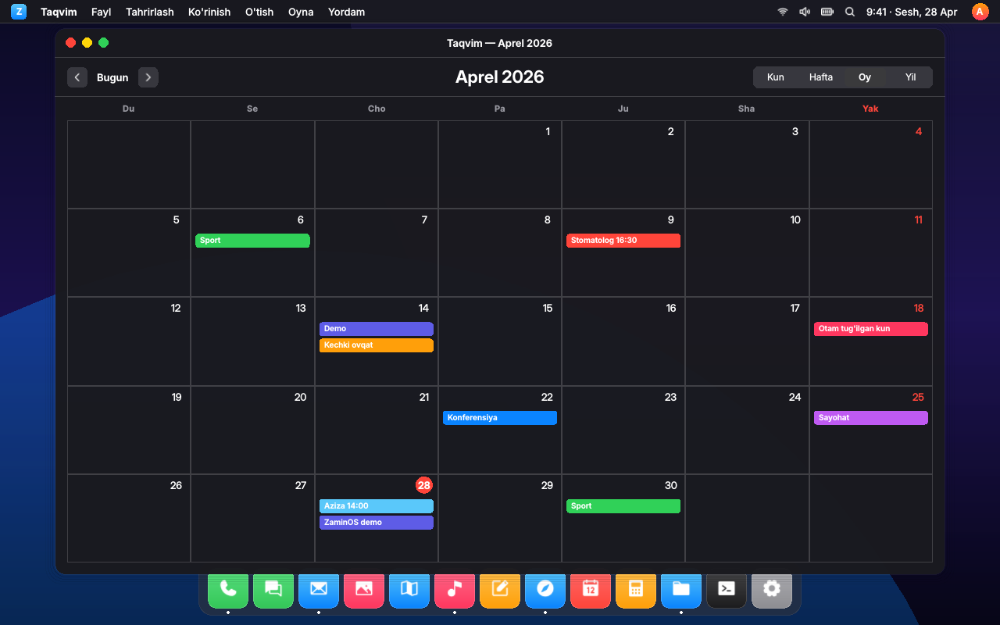 |

| Musiqa | Mission Control |
|:---:|:---:|
| 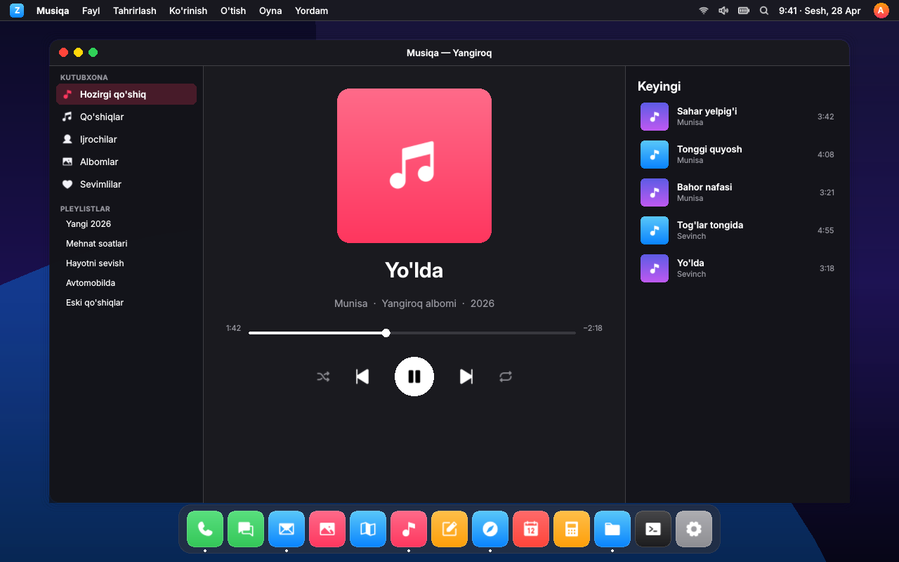 | 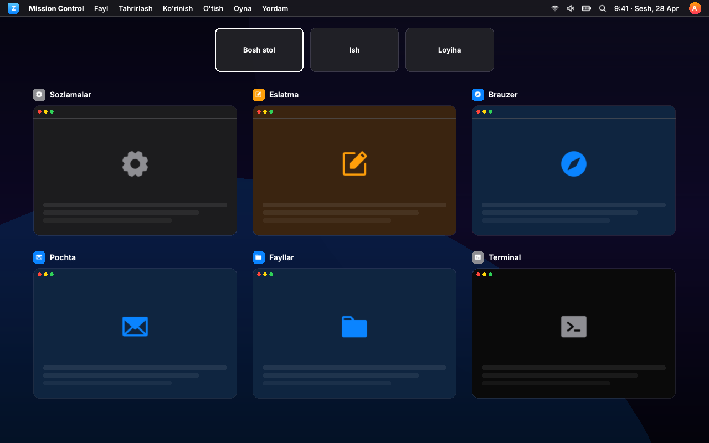 |

### Spotlight

| Qidiruv |
|:---:|
|  |

## Loyiha tuzilmasi

| Yo'l                    | Vazifasi                                                              |
|-------------------------|-----------------------------------------------------------------------|
| `shell/qml/`            | ZaminOS qobig'i (har bir ekran alohida `.qml` fayl)                   |
| `shell/qml/components/` | Qayta ishlatiladigan UI bloklari (Icon, Button, Switch, ListRow, Window_, DesktopChrome, …) |
| `shell/qml/icons/`      | 130+ vektor ikonka — regular / fill / bold variantlari (Phosphor)     |
| `shell/preview/`        | Dizayn ko'rib chiqish vositasi va chiqarilgan PNG'lar                 |
| `formfactord/`          | Tashqi qurilmalarni aniqlovchi tizim xizmati                          |
| `packages/`             | ZaminOS paketlarining yig'ish retseptlari                             |
| `iso/`                  | Zamin Phone uchun o'rnatish tasvirini tayyorlash profili              |
| `kernel/`               | Zamin Phone qurilmasini qo'llab-quvvatlash sozlamalari                |
| `scripts/`              | `build-iso.sh`, `flash-zaminphone.sh`, `render-mockup.sh`             |
| `docs/`                 | Loyiha hujjatlari                                                     |

## Ekranlarni qayta chiqarish

```bash
./scripts/render-mockup.sh
# 21 ta PNG → shell/preview/out/
```

## Holati

Boshlang'ich bosqich. Konvergent qobiq dizayni 21 ta ekran uchun tayyor:

- **Mobile (11 ta):** lockscreen, bosh ekran, bildirishnomalar markazi,
  boshqaruv markazi, ilovalar almashtirgich, telefon qo'ng'irog'i,
  sozlamalar, sozlamalar→Wi-Fi, klaviatura (xabarlar), hisoblash, eslatmalar.
- **Desktop (9 ta):** kirish, bosh stol, fayllar, pochta, brauzer, taqvim,
  musiqa, mission control, spotlight.

Tizim xizmatlari va yig'ish skriptlari skelet ko'rinishida.

## Litsenziya

GPL-3.0-or-later.
