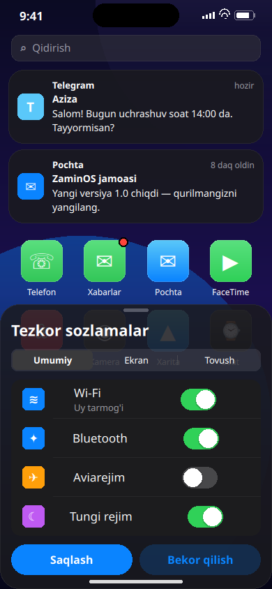
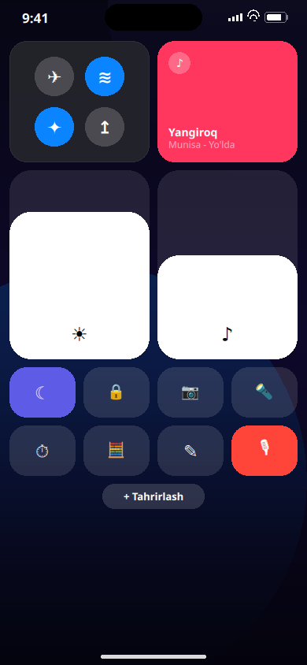
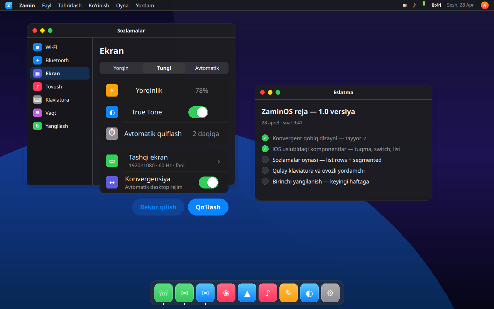
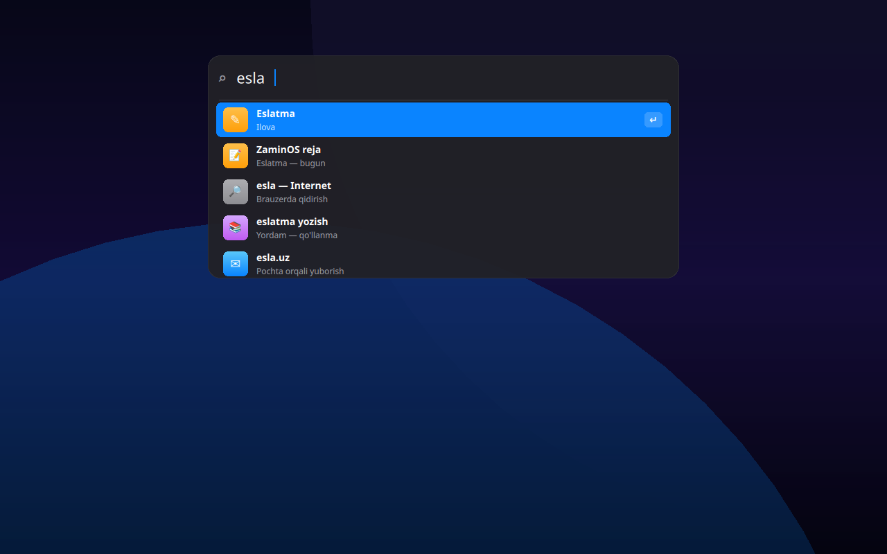

# ZaminOS

**ZaminOS** — Zamin Phone uchun zamonaviy, konvergent operatsion tizim.

Bitta tizim — ikki ko'rinish:

- **Mobile rejim** — telefonni qo'lingizda ushlaganingizda. Sezgir, sodda,
  bir qo'l bilan boshqariladigan interfeys.
- **Desktop rejim** — Zamin Phone'ga tashqi ekran, klaviatura yoki sichqoncha
  ulanganda avtomatik ravishda yoqiladi. Yuqori panel, oynalar, vazifalar
  paneli — to'liq ish stoli tajribasi, faqat bitta qurilmadan.

> *Zamin* (o'zbek tilida: "yer, asos") — har kuni qiladigan ishlaringiz
> tagidagi mustahkam asos.

## Xususiyatlar

- **Konvergensiya** — bir qurilma, ikki ish rejimi. Ulang — desktop bo'ladi,
  uzing — telefon bo'ladi. Hech qanday qayta yuklash, hech qanday sozlash.
- **Mahalliy o'zbek tili** — interfeys, klaviatura va ovozli yordamchi
  o'zbek tilida.
- **Yangi dizayn** — Zamin tabiatidan ilhomlangan rang palitra, silliq
  animatsiyalar, zamonaviy tipografika.
- **Maxfiylik** — ma'lumotlaringiz qurilmangizda qoladi.

## Ko'rinish

Shell dizayni — telefon bo'lmasa ham, kompyuterda PNG ga rasm qilib chiqarib
ko'rsa bo'ladi:

```bash
./scripts/render-mockup.sh
# → shell/preview/out/zaminos-mobile.png
# → shell/preview/out/zaminos-controlcenter.png
# → shell/preview/out/zaminos-desktop.png
# → shell/preview/out/zaminos-spotlight.png
```

### Mobile rejim

| Bosh ekran                                                  | Boshqaruv markazi                                                       |
|-------------------------------------------------------------|-------------------------------------------------------------------------|
|              |            |

### Desktop rejim

| Sozlamalar va eslatma oynalari                              | Qidiruv (Spotlight)                                                     |
|-------------------------------------------------------------|-------------------------------------------------------------------------|
|            |                    |

## Loyiha tuzilmasi

| Yo'l           | Vazifasi                                                  |
|----------------|-----------------------------------------------------------|
| `shell/`       | ZaminOS qobig'i (mobile + desktop interfeysi)             |
| `formfactord/` | Tashqi qurilmalarni aniqlovchi tizim xizmati              |
| `packages/`    | ZaminOS paketlarining yig'ish retseptlari                 |
| `iso/`         | Zamin Phone uchun o'rnatish tasvirini tayyorlash profili  |
| `kernel/`      | Zamin Phone qurilmasini qo'llab-quvvatlash sozlamalari    |
| `scripts/`     | `build-iso.sh`, `flash-zaminphone.sh`, `render-mockup.sh` |
| `docs/`        | Loyiha hujjatlari                                         |

## Holati

Boshlang'ich bosqich. Konvergent qobiq dizayni tayyor, tizim xizmatlari va
yig'ish skriptlari skelet ko'rinishida.

## Litsenziya

GPL-3.0-or-later.
